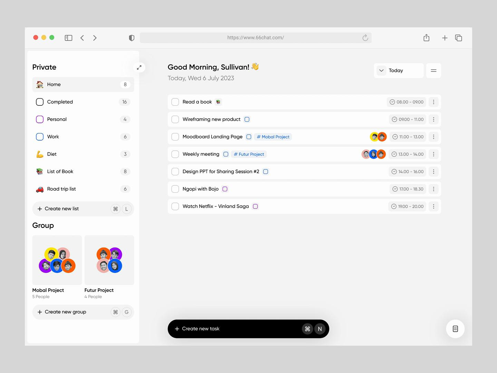

# CLAUDE.md
This file provides guidance to Claude Code (claude.ai/code) when working with code in this repository.

# 개요
- 간단한 TODO List Web을 만든다.
- 구성은 React(FrontEnd) + SpringBoot(BackEnd, Maven) + H2(Database) + Docker(Docker Desktop을 이용해 배포)로 되어있다.
- 연동되는 프로젝트는 총 3개(React, SpringBoot, Docker Template)이다.
- 현재 MY-TODO 프로젝트 내 api, ui, docker 디렉토리이다.
- **현재 상태:** `api`는 Todo CRUD(생성/목록/단건조회/수정/삭제/완료토글), category/priority/dueDate 필드, 예외처리, CORS 설정까지 구현 완료. `ui`는 Vite React-TS로 스캐폴딩 및 화면 구현 완료. `docker`는 멀티스테이지 Dockerfile + Docker Compose 완성. `skills`/`hooks` 정리 완료.

# 기술 스택
- **BackEnd:** Spring Boot 4.1.0 (Java 21, Maven). GroupId/ArtifactId: `my.todo:api`, 루트 패키지: `my.todo.api`. 주요 의존성: `spring-boot-starter-webmvc`, `spring-boot-starter-data-jpa`, `spring-boot-starter-validation`, `spring-boot-h2console`, `spring-boot-starter-restclient`, `spring-boot-devtools`(runtime), Lombok. 설정 파일은 `application.yml`.
- **Database:** H2 Database, 파일 기반 datasource (로컬 저장 경로: `D:\Workspace\data\harness-api`, JPA `ddl-auto: update`), H2 콘솔 활성화(`/h2-console`).
- **FrontEnd:** React + TypeScript (Vite). 서버 상태 관리는 TanStack Query, 스타일링은 CSS Modules, 테스트는 Vitest + React Testing Library, 린트는 ESLint(+ `@tanstack/eslint-plugin-query`). 백엔드 `ApiResponse<T>` 래퍼는 axios 인터셉터에서 언래핑.
  - ESLint 실행/규칙 관련 스킬(`.claude/skills/`)은 `ui` 스캐폴딩 완료 후 별도 작성 예정.
- **Deploy:** Docker (Docker Desktop 활용)
  - **Dockerfile.dev:** `docker/Dockerfile.dev` — 개발 환경 (API:8080 + UI 정적파일)
  - **Dockerfile.prod:** `docker/Dockerfile.prod` — 프로덕션 환경 (최적화: DDL validate, H2 콘솔 비활성화)
  - **Nginx 설정:** `docker/nginx.conf` — UI 정적 파일 서빙 + API 프록시 (`/api/` → API 컨테이너)
  - **Docker Compose:**
    - `docker-compose.yml` — 개발용 (Dockerfile.dev 사용). 사용: `docker-compose up`
    - `docker-compose.prod.yml` — 프로덕션용. 사용: `docker-compose -f docker-compose.prod.yml up`
  - **빌드 명령:**
    ```bash
    # DEV
    docker build -f docker/Dockerfile.dev -t my-todo:dev .
    docker-compose up
    
    # PROD
    docker build -f docker/Dockerfile.prod -t my-todo:prod .
    docker-compose -f docker-compose.prod.yml up
    ```
  - **환경변수:**
    - `API_PORT`: API 포트 (기본 8080)
    - `UI_PORT`: UI 포트 (기본 3000)
    - `PROFILE`: Spring 프로필 (dev/prod)
    - `API_BASE_URL`: UI가 호출할 API URL (기본 http://localhost:8080/api)
    - `SPRING_DATASOURCE_URL`: H2 DB 경로 (기본 jdbc:h2:file:/app/data/todo-db)

# 🛠️ Skills & Hooks
- **Skills** (`.claude/skills/`)
  - `validate-input.sh`: 입력값 검증 (API 요청본문, UI 입력폼, Dockerfile 형식)
    - 사용: `bash .claude/skills/validate-input.sh [api|ui|docker]`
- **Hooks** (`.git/hooks/`)
  - `commit-msg`: 커밋 메시지 10자 이상 검증
  - `pre-push`: 브랜치 네이밍 컨벤션 검증 (feature/*, fix/*, refactor/*, test/*)

# 구현 방향
## 🛠️ Build & Test Commands
- **BackEnd (`api/` 디렉토리에서 실행):**
  - JDK 21이 기본 `JAVA_HOME`이 아닐 경우, 커맨드 앞에 인라인으로 지정: `JAVA_HOME="/d/Workspace/java" ./mvnw.cmd ...`
  - 서버 실행: `./mvnw spring-boot:run` (Windows: `mvnw.cmd spring-boot:run`)
  - 전체 테스트: `./mvnw test` (Windows: `mvnw.cmd test`)
  - 단일 테스트 클래스/메서드: `./mvnw test -Dtest=클래스명#메서드명` (예: `mvnw.cmd test -Dtest=ApiApplicationTests#contextLoads`)
- **FrontEnd (`ui/` 디렉토리에서 실행):**
  - 개발 서버: `npm run dev` (http://localhost:5173)
  - 테스트: `npm test` (Vitest) / 단일 파일: `npm test -- src/utils/filterTodos.test.ts`
  - 린트: `npm run lint` / 타입체크+빌드: `npm run build` (`tsc -b && vite build`)
  - 세 명령은 서로 다른 것을 검사한다. `npm run build`는 타입체크+번들링만 하며 테스트도 린트도 돌지 않는다.

## 🪝 검증 자동화 (Harness)
- `.claude/settings.json`의 `Stop` 훅이 `.claude/hooks/verify-changed.sh`를 실행한다. 턴이 끝날 때 **git으로 변경이 감지된 영역만** 검사한다: `ui/` 변경 시 `tsc -b` + `eslint`, `api/` 변경 시 `mvnw test-compile`.
- 실패하면 `exit 2`로 차단되고 실패 내용이 에이전트에게 되돌아온다. 변경이 없으면 아무것도 실행하지 않는다.
- Git Bash 의존(`shell: bash`). JDK 21 경로는 환경변수 `JAVA_HOME_21`로 재정의 가능하며, 미설정 시 `D:\Workspace\java`를 사용한다.

## 🏗️ BackEnd 아키텍처 (`api`)
- **요청 흐름:** `TodoController`(`@RestController`, `/api/todos`) → `TodoService`(`@Transactional`, 조회 메서드는 `readOnly = true`) → `TodoRepository`(`JpaRepository<Todo, Long>`). 컨트롤러는 항상 `ResponseEntity<ApiResponse<T>>`를 반환하고, 실제 비즈니스 로직은 서비스에만 둔다.
- **패키지 구조:**
  - `todo`: 도메인 엔티티(`Todo`), 컨트롤러/서비스/레포지토리, `todo.dto`(`TodoCreateRequest`/`TodoUpdateRequest`/`TodoResponse`, 모두 record + Bean Validation)
  - `common`: `ApiResponse<T>` — `success(data)` / `success(data, message)` / `error(code, message)` 정적 팩토리만 사용해 생성 (생성자는 private)
  - `exception`: `TodoNotFoundException` + `GlobalExceptionHandler`(`@RestControllerAdvice`)가 `TodoNotFoundException` → 404/`TODO_NOT_FOUND`, `MethodArgumentNotValidException` → 400/`VALIDATION_ERROR`, 그 외 `Exception` → 500/`INTERNAL_ERROR`로 매핑. 새 예외 타입 추가 시 이 핸들러에 케이스를 추가할 것.
- **엔티티 규칙:** `Todo`는 `@NoArgsConstructor(access = PROTECTED)` + 의미 있는 생성자/`update()`/`toggleCompleted()` 메서드로만 상태 변경 (setter 없음). `createdAt`/`updatedAt`은 `@PrePersist`/`@PreUpdate`로 자동 관리.
- **Spring Boot 4.1 패키지 변경 주의:** 3.x와 테스트 슬라이스 패키지가 다르다. `@WebMvcTest`는 `org.springframework.boot.webmvc.test.autoconfigure`, `@DataJpaTest`는 `org.springframework.boot.data.jpa.test.autoconfigure`에 있고, Jackson `ObjectMapper`는 `tools.jackson.databind.ObjectMapper`를 사용한다(`com.fasterxml.jackson.databind` 아님). 새 테스트 슬라이스나 (역)직렬화 코드를 작성할 때는 import 경로를 반드시 실제 jar(`jar tf`)로 재확인할 것.

## 🏗️ FrontEnd 아키텍처 (`ui`)
- **API 경계:** `src/api/client.ts`의 axios 인터셉터가 백엔드 `ApiResponse<T>` 래퍼를 벗겨내므로, 컴포넌트/훅은 순수 데이터만 다룬다. `success: false`거나 에러 응답이면 `ApiError(code, message)`로 reject된다. baseURL은 `VITE_API_BASE_URL` 환경변수로 재정의 가능(기본 `http://localhost:8080/api`).
- **서버 상태:** TanStack Query. 조회는 `hooks/useTodosQuery.ts`, 변경은 `hooks/useTodoMutations.ts`(성공 시 `todos` 쿼리 invalidate). 쿼리 키 상수는 `queryClient.ts`의 `TODOS_QUERY_KEY`.
- **LocalStorage:** TanStack Query의 persister(`queryClient.ts`)가 유일한 접점이다. 앱 코드에서 `localStorage`를 직접 호출하지 말 것 — 저장소가 아니라 캐시 영속화 용도다.
- **UI 상태:** 라우터를 쓰지 않는다. 사이드바 선택 뷰/검색어/우선순위 필터/드로어 상태는 `context/AppUIContext.tsx`가 보관하고 `context/useAppUI.ts`로 읽는다. Context 인스턴스는 Fast Refresh 규칙(`react-refresh/only-export-components`) 때문에 `context/appUIContextInstance.ts`로 분리되어 있다.
- **필터링:** 전부 클라이언트 계산이며 순수 함수로 분리되어 테스트된다. `TodoList`에서 `filterTodosByView`(뷰) → `applySearch`(제목/설명 부분일치) → `applyPriorityFilter` → `sortTodos`(마감일↑ → 우선순위↓ → 생성일↓) 순으로 `useMemo` 적용. 뷰 정의: Inbox=미완료 전체, Today/Upcoming=미완료+마감일 기준, Completed=완료 전체, Work/Personal/Study=카테고리 일치(완료 포함).
- **날짜:** 별도 라이브러리 없이 `YYYY-MM-DD` 문자열 비교(`utils/dateUtils.ts`). 백엔드 `LocalDate`와 그대로 대응된다.

## 🚨 Global Rules (코딩 및 설계 절대 원칙)
- **보안:** SQL Injection 방지를 위해 반드시 ORM(JPA) 또는 Prepared Statement를 사용할 것. API Key, DB 계정 등 시크릿 키를 절대 하드코딩하지 말 것.
- **API 표준:** 모든 API 응답은 반드시 사내 표준 포맷인 `ApiResponse<T>`을 준수할 것.
- **테스트 주도/동반:** 테스트 코드가 동반되지 않은 비즈니스 로직 코드는 작성하지 말 것.
- **데이터 구조:** To-Do의 depth는 반드시 **1 레벨**로 유지할 것 (중첩 구조 금지).

## Todo List 웹의 UI/UX 방향
```
아래 첨부한 레퍼런스 이미지의 디자인을 메인 레퍼런스로 사용해줘.

핵심 디자인 특징:
- 왼쪽 Sidebar + 오른쪽 Main Content 구조
- Sidebar는 약 220~240px
- 미니멀하고 정돈된 UI
- 충분한 여백
- subtle한 border
- 과하지 않은 border-radius
- shadow는 최소화
- 깔끔한 Sans-serif Typography
- Lucide 계열 아이콘
- 현재 선택된 메뉴는 은은한 배경색으로 강조
- Todo Item은 복잡한 카드보다는 깔끔한 List 형태
- Hover 시 자연스럽게 action이 나타나는 방식
- 완료된 Todo는 muted + strike-through
- 전체적으로 Linear와 비슷한 밀도와 완성도를 유지

화면 구조:

Sidebar
- Inbox
- Today
- Upcoming
- Completed
- Lists
  - Work
  - Personal
  - Study

Main
- 페이지 제목
- Todo 통계
- Add Task 버튼
- Search
- Filter
- Todo List

Todo에는 다음 정보를 표현:
- Checkbox
- Title
- Category
- Due Date
- Priority

Add/Edit Todo는 Modal 또는 Drawer 중 전체 디자인에 더 잘 어울리는 방식을 선택해줘.

기능:
- CRUD
- Complete / Uncomplete
- Priority
- Category
- Due Date
- Search
- Filter
- LocalStorage persistence

중요:
이 요구사항을 바로 구현하기 전에 현재 프로젝트 구조와 CLAUDE.md의 규칙을 먼저 확인해줘.

기존 프로젝트의 기술 스택과 구조를 최대한 유지하고, 불필요한 라이브러리나 구조 변경은 하지 마.

구현 전에 먼저 현재 상태를 분석하고 구현 계획을 세워줘.

구현 후에는 lint / typecheck / build 등의 프로젝트에서 사용 가능한 검증 방법을 찾아 실행하고, 발생한 문제를 직접 수정해줘.
```
